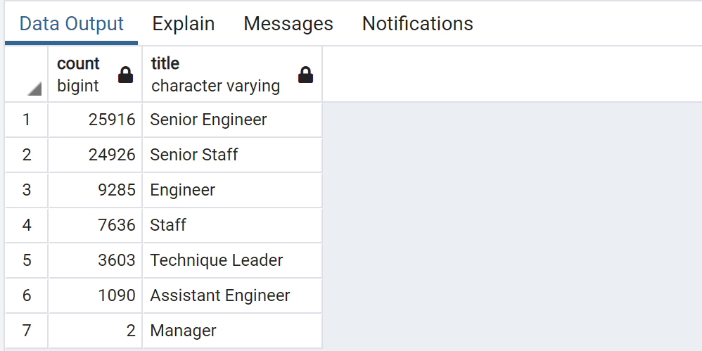

# Pewlett-Hackard-Analysis
Purpose:
The purpose of this analysis is to prepare Pewlett-Hackard for the upcoming “silver tsunami” by
determining the number of retiring employees per title and retiring employees who are eligible to participate in a mentorship program

Results: 

- Highest number of retiring employees are under the title of Senior Engineers, followed by Senior Staff
  

- 1549 retiring employees are eligible for the mentorship progam. However, highest number of eligible mentorship title falls under "Staff" followed by "Senior Engineer:

Summary:
- As the "silver tsunami" begins to make an impact, 72,458 roles would be impacted and "Senior Engineer" and "Senior Staff" title would be the most impacted.  
- As for qualified, retirement-ready employees in the department, there are not enough qualified, retirement-ready employees therefore, the company should hire more experienced workforce. 